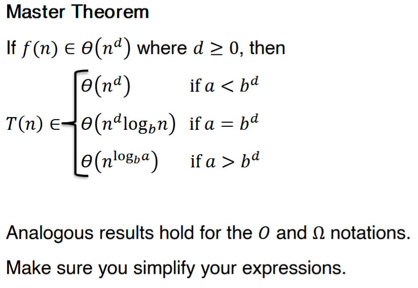
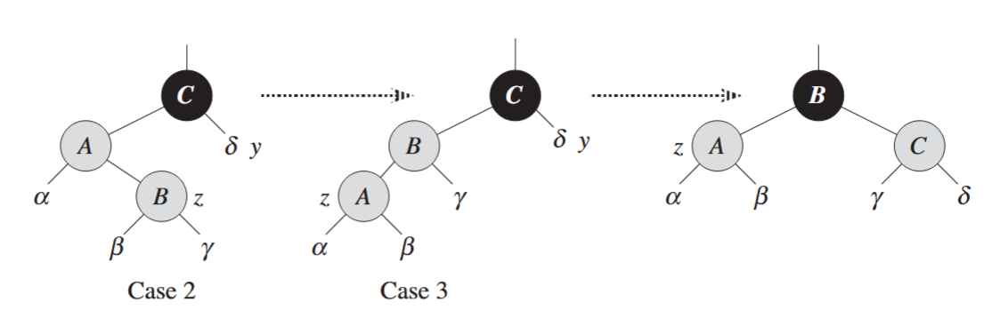
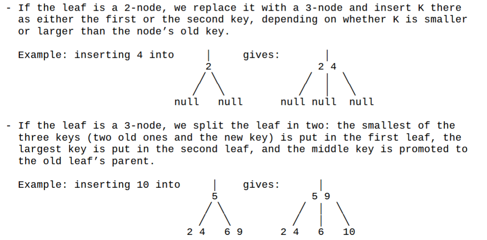

2% penalty for each hour late


# C++
- java main method == int main(void){}
- smallest valid C++ file:
```c++
int main(void){
    return 0;
}
```

- when you have the makefile in the directory with the program, run `make` to make the program and then run the exe (no file extension)
- the test script will compile and test the cpp file automatically
- `System.out.print("hello world")` ↔ `std::cout << "hello world"`
  - adding `<< std::endl` brings the cursor it to the next line like `println`
- `import` ↔ `#include`
  - full file:
    ```c++
    #include <iostream>

    int main(void){
        std::cout << "hello world" << std::endl;
        return 0;
    }
    ```
- if we include `using namespace std;` we can remove `std::` and just use its methods
    ```c++
    #include <iostream>
    using namespace std;

    int main(void){
        cout << "hello world" << endl;
        return 0;
    }
    ```
- `cin >> name` gets input from the keyboard
  - to save it to a variable it must already be instantiated
    ```c++
    #include <iostream>
    using namespace std;

    int main(void){
        string name;
        cout << "hello world" << endl;
        cin >> name;
        cout << "my name is: " << name << endl;
        return 0;
    }
    ```

## Accepting input

- we want to see
```c++
$ ./maxtwo 23 57
57
```
so we use the header:
```c++
int main (int argc, char* argv[])
```
- `argv` is a list of strings; it contains the function call and all of the arguments you give it
  - i.e. `{"./maxtwo", "23", "57"}`
  - since `argv[0]` is the name of the program as the user called it, then we can just call `argv[0]` to remind them of it.
- first we need to check that the user gave the right amount of arguments
  - `argc` gives us the number of arguments
  - i.e. for the call we want, we check that `argc = 3`
```c++
#include <iostream>
using namespace std;
int main (int argc, char* argv[]){

  if (argc !=3){
    cerr << "Usage: " << argv[0] << "<int> <int>" << endl;
    return 1;
  }

  return 0;
}
```
- now we need to turn the strings into integers
- istringstream lets us read fro the input as if we are actively reading it from the keyboard
  - we need to include the sstream header to use it
```c++
#include <iostream>
#include <sstream>
using namespace std;
int main (int argc, char* argv[]){
  istringstream iss;
  int n;

  if (argc !=3){
    cerr << "Usage: " << argv[0] << " <int> <int>" << endl;
    return 1;
  }

  iss.str(argv[1]); /*iss now contains the first argument*/
  iss >> n; /*we read from iss to n. c++ already knows that we want it to be an integer.*/
  cout << n; /*we'll check if this worked or not.*/

  return 0;
}
```
- if we put in an argument that's not an int, our program will break:
```c++
$ ./maxtwo fghjkl 57
0
```
- because the conversion will return true/false if it succeeds/fails, we can add a control block as such:
```c++
#include <iostream>
#include <sstream>
using namespace std;
int main (int argc, char* argv[]){
  istringstream iss;
  int n, m;

  if (argc !=3){
    cerr << "Usage: " << argv[0] << " <int> <int>" << endl;
    return 1;
  }

  iss.str(argv[1]); /*iss now contains the first argument*/
  if (!iss >> n){ /*this line *always* does the conversion whether it fails or succeeds.*/
    cerr << "Error: first command line argument must be int" << endl;
    return 1; /*we have to quit the user out so we don't run the program with wrong inputs anyway.*/
  }

  iss.clear(); /*the istringstream needs to be cleared to remove residual data from the first argument. you could use a second one instead of reusing just one if you wanted.*/
  iss.str(argv[2]); /*iss now contains the second argument*/
  if (!iss >> m){ 
    cerr << "Error: second command line argument must be int" << endl;
    return 1;
  }

  cout << "max(" << n << ", " << m << ") is " << max(n,m) << endl;

  return 0;
}
/*and we've added the actual algorithm to finish.*/
int max(int n, int m){
  if (n > m) return n
  else return m
}
```

and now we will see the thing we want to see:
```
ubuntu@ubuntu:~/Documents/CS385/maxtwo$ ./maxtwo 23 57
max(57, 57) is 32762
```

## Pointer
a pointer stores a memory address of something 
```c++
int x = 5;
int *z = &x;
```
- now z is pointing to x which contains 5.
  - when declaring z the `*` is the pointer type.
- z and x have different addresses
- calling `&z` accesses the address of z, which the computer assigns
- calling `z` accesses the address of **x**, which we stored in it
- calling `*z` accesses the *value* of **x**
  - the star here is the *dereference* operator.
- if we try
  ```c++
  z+=3000;
  ```
  - now z points to some other memory address, 3000 addresses after x, likely random garbage. 
  - the compiler will let you do this. do not do this.
- if a pointer is pointing to a bad place, you will get a `Segmentation fault` or it might just keep running with garbage data
- if you do get a segmentation fault, running `gdb ./[program]` then `run` tells you what line of code causes the error
  - though it will tell you when the garbage is accessed, not when it becomes garbage
  - will not work if you aren't getting a segmentation fault
  - you will need to quit gdb afterward
- when a function call happens, the variable with which it was called (say x) and the variable that is passed to it (say k) will be at different addresses.
  - i.e. any changes that happen to k in the function will not happen to x
  - this is *pass by value*
  - k is destroyed at the end of the function
  - this works the same as python, java, etc
- what if we want to modify `x` in main from the function?
  - we *pass by pointer* instead
  - the function definition takes pointer `*k` so we can pass `f(x&)`
  - now `f`'s code can effect `x` while calling it `*k`
- we also have *pass by reference* in C++
  - define the function with `&k` so you don't need to call the function with the address every time
  - only uses one memory address; k is a reference to the *same* address as x
  - only for the programmer; the compiler rewrites it as pass by pointer for the computer

### Pointers with Dynamically Allocated Memory
- you can declare `int y[10]` with 10 spaces
  - you can call them by `y[i]`
- but if you don't know how many spaces you need, it needs to be declared dynamically
  ```c+++
  cout << "x is" << x << endl;
  int *values;
  values = new int[x];
  ```
  - `values` is only pointing to the first element of the array
    - the rest are stored sequentially after it
  - we can still call elements like in java as `value[i]` 
  - or we can call them like C as `*(values+i)`
- when passing the array to a function, you can pass it like an array or like a pointer
  - just define it in the way you want it
  - `int array[]` → use `array[i]`
  - `int *array` → use `*(values+i)`
- you will need to know the length when iterating
  - there is no `.length` and going past the end will rarely cause a segmentation fault
- when you are done with the array memory you must delete it
  - java and python just do it for you. c++ does not
  - for each `new` there must be a `delete` somewhere
  - i.e. `values = new int[x];` → `delete [] values;`
    - usually done right before `return 0;` at the end
  - after the `delete`, the pointer will be dangling (pointing to nothing/garbage)
  - you can reassign `values` to point to something else if you want

## Classes
- declared like java
- everything under the `public:` header is a public member/method
  - everything under `private:` is private
  - does not have brackets
- constructor with initializer list lest you set everything without a bunch of code
  - put a semicolon after constructor header then list `instance_variable{input}`
  - then `{ }` to because the code block is required even if it is empty
- methods that do not modify member (instance) variables should be declared `const` after the header
  - `void print() const { ... }`
  - NOT like static methods
  - the only requirement is that they do not mutate a member
- class definitions end with semicolons
  - `class Student { ... };`
- local declaration to the stack: `MyPoint point1(x,y,z);`
  - this variable disappears at the end of the method
- declaration to the heap: `MyPoint *point4 = new MyPoint(x,y,z);`
  - similar to java except `point4` is a *pointer* to an anonymous `new MyPoint`
  - the `new` object will stick around until it is actively deleted with `delete point4;`
    - no square brackets because it's just an object, not an array
    - can give it the pointer because it will delete what's at that address, but NOT the content of `point4`
    - `point4` will now point to something that does not exist
    - you should be cleaning up garbage as you go (as you stop using it), not waiting until the very end
- you can use a class an an interface
  - define the class's members and methods with no code blocks/values, then put all of the code for it in a different file

## Vectors
- like an ArrayList
- requires `#include <vector>`
- declare like `vector<MyPoints> points;`
- then use `points.push_back(point1);` to put objects in it
- can access elements like `points[1]`
- we also have `points.size()`, but it returns a `size_t` type
  - `size_t` is effectively the type that can hold the largest possible integer
  - it prints like a regular integer

### regular for loop
```c++
for (size_t i = 0; i < points.size(); i++) {
  points[i].print_coords();
}
```

### for-each loop
```c++
vector<MyPoints> points;
for (const auto &point : points){
  ...
}
```
- `point` is the loop variable
  - it is a reference;
  - we do this instead of copying the element from the array into the loop every time
- `const` tells the compiler to throw an error if we try to change the elements
- `auto` automatically gets the type of the elements in the vector

### iterator loop
```c++
for (auto it = points.cbegin(); it != points.cend(); it++){
  it->print_coords(); // equivalent to (*it).print_coords();
}
```
- `it` is our iterator
- we use `auto` here because the type of the iterator is ugly
- `it++` magically makes the iterator move to the next element
- `->` calls the method with the object the iterator points at

# Algorithms
- an algorithm is a sequence of unambiguous instructions for solving a problem
- its inputs must be specified carefully
- the same algorithm can be implemented different ways
- multiple algorithms might solve the same problem

- sieve - taking a list an removing items that do not fit some criteria
- sum of integers `[1,n]` = n(n+1)/2

# Asymptotic Notation / Rates of Growth
- every function is its own upper bound and lower bound
- you can remove any lower-degree term from the final notation
  - i.e. O(5n² + n) → (n²)
  - this is now asymptotic notation
    - the asymptote is the same even if it's off from the actual function
- when calculating time
  - we can call the time needed for one command c₁
  - and overhead time for initializing loop variables and returning output c₂ both
  - for a loop that runs n times, this makes the whole function n * c₁ + c₂
  - we remove all this when finding asymptotic notation though
    - we care about how it grows, not how long it actually takes
- all logs get written as log n because logs with constant bases differ by a constant factor which we can ignore

## Big O
- O(1) is the best possible rate, as ther is nothing lower
- O is the *asymptotic upper bound* of the function
  - i.e. when n is infinitely large
- any line "under" O(n) is technically part of it
  - e.g. 10n + 5 is in O(n²)

## Big Omega
- Ω() is the *asymptotic lower bound*
- anything above Ω() is part of it
  - e.g. n³ is in Ω(n²)

## Big Theta
- Θ(n) includes both O(n) and Ω(n)
- gives us an *asymptotically tight bound* on running time
- e.g. for Θ(n), there are some k₁, k₂ where k₂n > n > k₁n for large values of n
  - 
  - we're not too worried about small values of n
- the same thing applies for any other random function of n
  - 


## Theorem
 for Ω use min()

### Limit Rule for Growth Rate Comparison

- we will rarely find that the limit DNE
  - still, the fact that it can happen makes this way less general than other ways
- recall L'Hopital's rule
  - 
- also consider sterling's formula
  
  - larger n → better approximation of n!

## Problem Sizes
let's say we have 1 hour of computation time = 3.6*10⁹ microseconds. 
if 
  - we have an algorithm with f(n) = log₂(n)
    - log₂(n) = 3.6\*10⁹ ⇛ n = 2^(3.6\*10⁹) which is a lot of possible calculations
    - note that lg(n) == log₂(n)
  - we have f(n) = n
    - n = 3.6\*10⁹
- some rules about logs and more in [this handout](/notes/Guidelines%20for%20Asymptotic%20Analysis.pdf)

# Check that all characters in string are unique
- set up an unsigned int = 0 and use it as a vector
```
         hgfedcba
vector = 00000000
```
- now we can have a setter shift a 1 into the correct place
  - say we read a g:
  ```c++
  setter = 1 << ('g' - 'a');
  ```
  ```
           hgfedcba
  setter = 01000000
  ```
- do a bitwise `&` between them
  - if it = 0, we have never seen the character before
  - if it is > 0, the character is a duplicate
- now we must remember that we have seen this character (here 'g')
- now we bitwise or `|` the setter and vector to remember all seen characters
  - and put the result into vector
  - e.g. vector = 01000000 ⇛ we've only seen 'g'
  - vector = 11000000 ⇛ we've seen 'gh' in any order

# Recurrence Relations
I have no idea how to explain this. read [his notes](Recurrence%20Relations%201%20Selection%20Sort.txt).

# Stair Climber Problem
- for this section * means prepended with, + means concatenation, and i have to put bracket-heavy lines in `verbatim` formatting to not break vs code
- there are no ways to climb up 0 stairs. lol. lmao. `get_ways(0) = [[]]`
  - ways of climbing stairs = going up combinations of stairs 1 ≤ no. of stairs ≤ 3
- to find amount of ways to climb one stair = get_ways(1), it's
  - 1 prepended to each solution in get_ways(1-1) = get_ways(0) = `1 * [[]]`
  - = `[[1]]`
- get_ways(2)
  - = 1 prepended to each solution of get_ways(2 - 1) = get_ways(1) + 2 prepended to each solution of get_ways(2 - 2) = get_ways(0)
  - = `1 * [[1]] + 2 * [[]]` = `[[1,1] [2]]`
    - ⇛ go up 1 stair then one more stair or go up 2 stairs
- `get_ways(3) = [[1,1,1], [1,2], [2,1], [3]]`
- generally,
  - get_ways(n) = 
  - 1 prepended to each solution of get_ways(n - 1) +
  - 2 prepended to each solution of get_ways(n - 2) + 
  - 3 prepended to each solution of get_ways(n - 3)
- we are prepending to keep everything in first-element-ascending order
- for this algorithm's complexity, we'll look at amount of solutions output instead of running time
  - |get_ways(3)| = 4 = T(3)
  - T(n) = T(n-1) + T(n-2) + T(n-3)
    - with base cases T(0) = 1, T(1) = 1, and T(2) = 2
    - backwards substitution will be miserable
      - works best with only one recursive call
  - instead of calculating exactly (will take forever) we'll approximate with best and worst cases
    - we know it's similar to fibonacci numbers, but it grows faster with one extra recursive call
    - T(n) for fibonacci = F(n) = ϕⁿ/√5 where ϕ = (1 + √5)/2 ≈ 1.62 (golden ratio)
      - which grown exponentially
      - which means our T(n) is at least exponential
  - T(n-1), T(n-2), and T(n-3), have upper bounds of T(n-1)
    - ⇛ T(n) ≤ 3T(n-1) ≤ 9T(n-2) ≤ ... ≤ 3ⁿT(0) = 3ⁿ
      - recall T(0) = 1
  - which leaves up with T(n) = 3ⁿ
    - you an also diagram out the recursive call tree and get the same answer
  - which also means F(n) = ϕⁿ/√5 ≤ T(n) ≤ 3ⁿ
  - out function is also the tribonacci (sum of previous 3 numbers), whose function is ugly but T(n) ∈ Θ(1.84ⁿ), which confirms our exponential growth theory

# Brute Force Algorithms
- find the space of all possible solutions and keep trying until you find the right one
- `struct` is a class except everything is public by default
- a pair acts as a vector of only size 2
  - must `#include <utility>`
- typically has simple code but bad run times
- in c++ you can modify how operators work with a class
  ```c++
  // The new operator<< automatically is a member of the ostream
  // class (that's where the original << operator is defined)
  // so it needs to be a "friend" of the Triple class to be able
  // to access the private instance variables a, b, and c.

  friend ostream& operator<<(ostream &os, const Triple &t) {
  os << t.a << "^2 + " << t.b << "^2 = " << t.c << "^2";
  return os;
  }
  ```
  - *adds* functionality
  - `ostream` is the type of `cout`
    - we use a reference to cout instead of copying it because it will break print continuity
    - we need to return os so you can continue chaining it in use
      - e.g. `cout << triple << endl`
  - `Triple t` is our new type whose functionality we're defining
  - the `friend` keyword lets the `ostream` class look at parts of our `triple` class that it needs to print out our `Triple`
    - in the end it becomes part of the `ostream` class since this is extending its functionality

# Elementary Sorting
- don't use them (bad)
- best case is the perfect input (algorithm doesn't need to do anything)
- average case is when input is truly random
- worst case is when the algorithm needs to do the most
- best, worse, and average cases all have their own big O/Ω bounds
- we measure overall run time from Ω of the best case to O of the worse case

## Bubble Sort
- if you use bubble sort they kill you
  - continuously "bubbles up" largest/second-largest/etc values to tne end
- bubble sort is always Θ(n²) (best, worse, and average cases)
  - even when we optimize it as much as possible, average, worst, and overall cases are Θ(n²)

## Selection Sort
- selection sort puts the smallest at the beginning or the biggest at the end, one at a time
- scans the unsorted part to find the minimum element

## Insertion Sort
- takes the next-smallest value and puts it in the smallest correct position from the beginning
- scans the sorted part to find the correct position to place the element
- the closer the array is to sorted, the closer insertion sort gets to Θ(1)

# Graphs
- degree = amount of edges touching a vertex
- a graph does not need to be one piece
- in code, a graph will be represented as a adjacency list or matrix
  - matrices are better for small or dense (amount of edges near max edges = V²) graphs, where lists take up more space
  - lists are better for sparse graphs where matrices take up a bunch of empty spaces

## Breadth-First Search (BFS)
- start at source and increase distance from the source to travel the graph
- we need a counter which we increase for each new vertex visited
- we need an array of integers to track which vertices we've been to (initialized to all zeros)
  - when we reach a new vertex we'll set its place in the array to the counter so we know in what order we visited it
- a queue of vertices whose neighbors we have yet to visit
- algorithm:
  
- using an adjacency list this takes Θ(V+E)
  - linear search through each vertex and through its edges = Θ(V+E)
- with an adjacency matrix it takes Θ(V²)
  - linear search through each vertex then through all of its *possible* edges ==> Θ(V²)
- paths made by breadth-first search are commonly drawn as rooted trees
- nonrecursive pseudocode:
  

## Depth First Search (DFS)

- depth-first search is used for solving mazes
  - it uses a stack instead of a queue
  - or we can use the function call stack as that stack instead of making one ourselves
- move away from the source as quickly as possible, then return 
- since it's so similar to BFS, just with a different data structure, its running times are similar
  - Using an adjacency matrix: Θ(V²).
  - Using an adjacency list: Θ(V + E).
- iterative python code:
```py
# prints all not yet visited vertices reachable from s 
def DFS(self,s): # prints all vertices in DFS manner from a given source.

    # Initially mark all vertices as not visited 
    visited = [False for i in range(self.V)] 

    # Create a stack for DFS 
    stack = []

    # Push the current source node. 
    stack.append(s) 

    while (len(stack)): 
        # Pop a vertex from stack and print it 
        s = stack[-1] 
        stack.pop()

        # Stack may contain same vertex twice. So 
        # we need to print the popped item only 
        # if it is not visited. 
        if (not visited[s]): 
            print(s,end=' ')
            visited[s] = True

        # Get all adjacent vertices of the popped vertex s 
        # If a adjacent has not been visited, then push it 
        # to the stack. 
        for node in self.adj[s]: 
            if (not visited[node]): 
                stack.append(node) 
```


## Topological Sort
- take a **directed** graph and sort them into one row where all arrows point right
- result is typically not unique
- if the graph has a cycle, topological sort will fail
- Vertices with no incoming edges have no dependencies and therefore can
be traversed first.
### Kahn's Algorithm for Topological Sort
- first we need:
  - An array of integers with one element for each vertex, which we use to
  store the current number of incoming edges each vertex has (the indegree of
  the vertex). 
    - This array can be initialized by setting every value in the array to zero and then traversing the adjacency list or adjacency matrix representing the graph and increasing by 1 the value in the array for every vertex which is the destination of an edge.
  - A set S of all the vertices in the array which currently have an
  indegree of zero. 
    - This is the set of vertices that can be traversed first.
    - This set can be implemented either as a queue or as a stack, it does not matter (but it might produce different results), so here we use a queue.
    - This set can be initialized by traversing the array we just described above and putting into S all the vertices in the array that have an indegree of zero (in increasing order).
  - An empty list L that will contain the result of the topological sort.
- using DFS to do topological sort will always contain all vertices
- it will also work even when there is a cycle
  - we keep track of vertices we've already looked at, so we don't get caught in the cycle
- pseudocode:
  
  
# Water Jug Puzzle
- three jugs of water A, B, C who initially carry A, B, and C gallons of water respectively
- A, B are empty and C is full initially
- we pour water between A, B, C with conservation
  - current amount of water in A, B, C = a, b, c
  - when we do this we have to keep pouring until the destination jug is full or the source jug is empty
- we get the size of each jug from the command line
  - e.g. waterjug 3 5 8 . . . ⇛ we start with capacities (3, 5, 8) and initial state (0, 0, 8) = (A, B, C)
- we also get the goal state from the command line
  - e.g. waterjug . . . 3 5 0 means we want to end up with the jugs containing (3, 5, 0) = (a, b, c)
- our assignment is to find the shortest path from initial to goal condition
  - we use BFS because it gives you the shortest path
- we have been prescribed 6 water transfers, in this order:
  1. C → A
  2. B → A
  3. C → B
  4. A → B
  5. B → C
  6. A → C
  - which means each vertex has ≤6 neighbors
- we don't need to physically create a graph, we just imply one
- need a way to remember which vertex has been visited
- we need to remember the parent of each vertex
- do both: store all previous vertices in a 2d array at `array[a][b]`
  - c = C - a - b
  - array has A+1 rows and B+1 columns

# test review
- largest size n of a problem that can be solved in 1 minute with running time n²
  - n^2 ≤ 60000 ms = 1 min
  - n ≤ √60000 = 244.94, 
  - always round down to **244 = n**
- is 3n-4 ∈ Ω(n²)? give c, n₀ or prove false by contradiction
  - no
  - assume that cn² ≤ 3n-4 ≤ 3n for all n ≥ n₀
  - cn² ≤ 3n
  - cn ≤ 3
  - n ≤ 3/c for all n ≥ n₀; impossible
- solve x(n) = 2x(n-1); x(1) = 4
  1. x(n-1) = 2x(n-2)
     1. x(n) = 2(2x(n-2))
  2. x(n-2) = 2x(n-3)
     1. x(n) = 2(2(2x(n-3)))
  3. x(n) = 2ⁱx(n-i)
  4. base case x(1) ⇛ n-i = 1 ⇛ n = i + 1
  5. x(n) = 2ⁿ⁻¹x(n-(n-1)) = 2ⁿ⁻¹x(1) = 2ⁿ⁻¹\*4 = 2ⁿ⁻¹\*2² = 2ⁿ⁻¹⁺² = 2ⁿ⁺¹
- create and clean up a student object on the stack then the heap
  ```c++
  Student a;

  Student *b = new Student();
  delete b;
  ```
  - can't remove local (stack) variables manually; they disappear when the function ends
  - need `b` to be a pointer or else we don't know its location and `delete` won't work
- what is (15<<2)^22?
  - 15 = 00001111
  - 15 << 2 = 00111100
  - 22 = 00010110
  - (15<<2)^22 = 101010 = 42
  - << = left shift
  - ^ = exclusive OR = XOR

# The Master Theorem
- skips the 5 steps of back substitution
- must follow the shape T(n) = aT(n/b) + Θ(nᵈ)
  - i.e. only divide and conquer, not decrease and conquer (which would call T(n-b))
- 
  - if we only know O() for f, then everything is O. same for Ω().
- a na db must be constants, not functions of n

# Selection Problem
- find the kth smallest integer in an array
- we could just sort the array but that's too slow
- we will use quick select
- leftmost element is pivot
- split the array into all elements \< pivot and all elements \> pivot
- put pivot in the middle, everything smaller on the left, and everything bigger on the right
  - this is one partition
- lomuto algorithm
  - Θ(n)
  - returns the correct position of the first element in the array
- quickselect willkeep partitioning until s (sorted position of pivot) = k - 1
  - in the sorted array, the kth smallest element will be at index k - 1
  - Ω(n), O(n²)
  - in the worst case, it's already sorted and we have to repartition for every single element ⇛ Θ(n²)
  - in a completely random case, it's more likely to be unsorted → ≈ Θ(n)
  - recurrence relation of T(n) = T(n/2) + Θ(n). using the master theorem it's still Θ(n)
- pseudocode:

  ```
  // Partitions subarray by Lomuto’s algorithm using first element as pivot.
  // Input: A subarray A[l..r] of array A[0..n−1], defined by its left and right indices l and r (l ≤ r)
  // Output: Partition of A[l..r] and the new position s of the pivot.
  LomutoPartition(A, l, r):
    p ← A[l]
    s ← l
    for i ← l + 1 to r do
      if A[i] < p
        s ← s + 1
        swap(A[s], A[i])
    swap(A[l], A[s])
    return s


  // Solves the selection problem by recursive partition-based algorithm.
  // Input: Subarray A[l..r] of array A[0..n − 1] of orderable elements and integer k (0 ≤ k ≤ n - 1)
  // Output: The value of the kth smallest element.
  Quickselect(A, l, r, k):
    s ← LomutoPartition(A, l, r)
    if s = k − 1 return A[s]
    else if s > k − 1 Quickselect(A, l, s − 1, k)
    else Quickselect(A, s + 1, r, k)
  ```

- to avoid the worst case, we can use the median value as the pivot
  - unfortunately it takes Θ(n) to find the median so we're not doing that
- we'll instead select the pivot at random
  - random number generation is slow too...
  - in practice, we'll use the median of 3 instead of the actual mathematical median
  - median of 3 = median of the first, central, and last elements
  - then we'll swap this new median of 3 pivot to the beginning and do the regular lomuto partitioning
  - still avoids the worst case by finishing in Θ(n) if the array is already sorted
    - not totally but basically
- turn this into quicksort by recursively partitioning the left and right unsorted parts of the array
  ```
  Quicksort(A, l, r):
    if(l < r)
      s ← LomutoPartition(A, l, r)
      Quicksort(A, l, s − 1)
      Quicksort(A, s + 1, r)
  ```
  - becomes Θ(nlogn)
  - best case recurrence relation T(n) = 2T(n/2) + Θ(n) ⇛ Θ(nlogn)
  - in the average case it's the same, just approximately instead of exactly
  - in the worst case it's still Θ(n²)
  - median of three will make worst case way less likely but it's still possible
- quicksort is the fastest known sorting algorithm
  - especially bc the code is so simple and the worst case is so unlikely
  - however smaller arrays are expensive for a lot of function calls on small arrays
  - on small arrays we might switch to insertion sort, which is inexpensive on small arrays


# Radix sort
- to sort number with larger ranges we can do multiple sorts by each digit of the numbers
  - must use a stable sorting algorithm
  - that way at no point do they go out of order
  - me use a fancy version of counting sort that is stable
  - we could sort by more digits at a time
    - this squares the number of counter needed
    - going from 10 to 100 to sort 2 digits at a time
- we might use decimal bytes as counters to reduce memory space
- requires begin able to split numbers/strings/etc into smaller bits
  
# Russian Peasant Multiplication
- you don't want to use this algorithm unless you have to.
  - most CPUs have better (long) multiplication built in
  - this is only useful if you have a cheap as shit cpu that doesn't have multiplication built in
- we want to multiply n, m
- manual way:
1. runs faster if n < m, so swap if necessary
2. until n = 1:
   1. divide n by 2 (i.e. right-shift by 1)
   2. multiply m by 2 (i.e. left-shift by 1)
3. for all values of n that are even, remove its corresponding value of m
4. sum the remaining values of m
- code way:
1. swap n, m if necessary
2. while n > 0
   1. add m to sum if n is odd
   2. n /= 2 ≡ n >>= 1
   3. m *= 2 ≡ m <<= 1
3. we calculated the sum of ms for odd ns while finding each new m so return that sum
- which gives us:
```c
unsigned long russian_peasant_multiplication(unsigned int m, unsigned int n) {
    if(n > m) {
        swap(n, m);
    }
    unsigned long big_m = m, sum = 0;
    while(n > 0) {
        if(n & 1) { // same as: n % 2 == 1
            sum += big_m;
        }
        n >>= 1;
        big_m <<= 1;
    }
    return sum;
}
```
- running time: Θ(lg(min(m,n)))

# Binary Reflected Gray Codes
- sometimes binary numbers don't work.
  - e.g. to go from 1 (001) to 2 (010) you have to flip two switches as the same time
  - you cannot do this perfectly on a physical machine
  - there will be a moment where the switches will read out 0 (000) or 3 (011)
- gray codes make numbers vary by only one bit
  - 0: 000
  - 1: 001
  - 2: 011
  - 3: 010
  - 4: 110
  - 5: 111
  - 6: 101
  - 7: 100
- how do we make them?
  - this code generates all BRGC in n bits
    - i.e. from 0 to n-1
```py
def BRGC(n):
    if n == 1:
        return ["0", "1"]
    L1 = BRGC(n - 1)
    # Copy with step of -1, so reverse:
    L2 = L1[::-1] # notice we are *reflecting* the list
    # List comprehensions:
    L3 = ["0" + code for code in L1] # adds 0 to the start of every element of L1
    L4 = ["1" + code for code in L2] # adds 1 to the start of every element of L2
    return L3 + L4 # appending L3, L4
```
- the "reflected" part comes from the reflection step of the code
  - the gray part comes from inventor mr. gray
- there is no direct conversion from binary to BRGC or vice-versa
  - you just have to agree that 3 is 010.
  - you generate them once and have them in a reference table
- running time Ω(2ⁿ)
  - recall there are 2ⁿ permutations of n binary bits
  - it's usually worse. 
    - the slowdown is because of the list processing
  - T(n) = Θ(n2ⁿ)
  - it's fine that it's slow cuz we only ever run this once
    - plus n is usually gonna be small. single digits

# Lexicographic Permute
- fancy way of saying anagrams, but including nonwords
- lexicographic = dictionary order
  - the algorithm returns all permutations in lexicographic = dictionary order
```py
def lexpermute(s):
    n = len(s)
    # Convert s to a list and sort:
    a = list(s)   # ["c", "a", "t"]
    a.sort()      # ["a", "c", "t"]
    result = ["".join(a)]
    # Reverse start to get end:
    end = a[::-1] # ["t", "c", "a"]
    # Algorithm proper:
    while a != end:
        # let i be its largest index such that a_i < a_i+1
        for i in range(n-2, -1, -1):
            if a[i] < a[i+1]:
                break
        # find the largest index j such that a_i < a_j
        for j in range(n-1, -1, -1):
            if a[i] < a[j]:   
            # strictly less than stops the algorithm from duplicating strings, even when the string has duplicate characters
                break
        # swap a_i with a_j
        a[i], a[j] = a[j], a[i]
        # reverse the order of the elements from a_i+1 to a_n
        a[i+1:n] = a[n-1:i:-1]
        # add the new permutation to the list
        result += ["".join(a)]
    return result
```
- run time Θ(n*n!)
  - actually Θ(n*n! / (product of factorials af amount of times letters are duplicated))

# Karatsuba Multiplication
- only useful for massive numbers with hundreds of digits
  - i.e. cryptography
- if n is the amount of digits in the largest number being multiplied
- regular multiplication takes n² multiplications and (n-1)² additions excluding carries
- russian peasant multiplication takes Θ(n²) due to shifting
- karatsuba is a divide and conquer algorithm
- we'll multiply 2351 and 1234
  - 2531 = 23 * 100 + 31
  - 1234 = 12 * 100 + 34
  - 2531 * 1234 = (23 * 200 + 51) * (12 * 100 + 34)
  - = (23 * 12) * 10000 + ***(23 * 34 + 51 * 12)*** * 100 + (51 * 34)
  - (23 + 51) * (12 + 34) = 23 * 12 + ***23 * 34 + 51 * 12*** + 51 * 34
  - 2351 * 1234 = (*23 * 12*) * 10000 + ((23 + 51) * (12 + 34) - *23 * 12* - **51 * 34**) * 100 + **51 * 34**
  - there are only 3 unique multiplications here
- in practice people use Toom-Cook with is a version of this
- one you get to tens of thousands of digits, use Schonhage-Strassen
  - O(nlog(n)log(logn)), but with a  massive hidden constant
  - or its generalization which is O(nlogn)
  - possibly multiplication is Θ(nlogn) but nobody can prove a lower bound


# Trees
- path = sequence of edges
- depth = amount of edges from root to a node
- height of node = length of longest path to leaf
- height of tree = height of the root or depth of deepest leaf
  - = max depth
  - root has height 0
  - empty tree has height -1
- size = number of nodes
- width = amount of nodes at the same depth
- diameter of the tree = longest path that cna be taken within the tree, ignoring directions of edges

## Binary Trees
- in binary trees, a node can have ≤ 2 children
- maximum possible depth in n-1, where all elements are stacked in one big line
- traversal
  - preorder traversal: root L R
  - inorder traversal: L root R
    - because they're recursive you go all the way L, then the root, then one right and all the way left, etc
  - postorder traversal: L R root
  - 
  - traversal takes Θ(n)

## Binary Search Trees
- binary search tree where all values in every node's left subtree is always smaller than the node and the node is always smaller than all values in its right subtree
- WE WILL ONLY USE TREES WITH NO DUPLICATES
  - therefore all comparisons are strict
- we will sort by keys (e.g. ISBN no.s)
  - though in real life there will be other info (title, SKU, price...)
- inserting elements in random order is more likely to give a balanced tree
  - height of ceil(lg(n))
- if inserted in sorted/reverse-sorted order it will be completely unbalanced
  - recall max depth n-1
- inorder traversal of BST gives a sorted list on its nodes
  - not as good as quicksort since it has ot make the tree and write back into the OG array
- recall BST (directed) search algorithm
  - SEARCH(root, target):
    1. if root is null, return NULL
    2. if root is target, return root
    3. if target < root, return SEARCH(root.left, target)
    4. if target > root, return SEARCH(root.right, target)
  - runs Ω(1), O(tree height)
- find min by going left until you can't anymore, max by going right
  - might not be a leaf. it's fine, going inward will move you away from the extrema
  - findMin/findMax run O(tree height)
- recall BST insertion
- INSERT(root, x)
  1. IF root=Null, return root=CREATE-NODE(x)
  2. IF root=x, return Null
  3. IF root>x, return INSERT(root.left, x)
  4. ELSE, return INSERT(root.right, x)
  - like searching for where x should be and inserting it in the place where it would be
  - runs O(tree height)s
- recall 
  - pass-by-value, which copies the value of an argument and won't change the original, and pass-by-pointer which will change the value of the variable passed
- to be able to change the root of a tree, you'll need to save a pointer a to pointer to its Node
  - only if you use recursion
- deletion is basically searching and deleting it if you find it
  - you still need to make sure the BST property remains
  - if target is a leaf, just delete it
  - if target has one child, move parent's pointer to that child
  - if target has 2 children,
    - replace it with minimum node of right subtree, put *its* right subtree where it was
    - or replace it with maximum node of left subtree, put *its* left subtree where it was
    - using findMin/findMax
  - always O(tree height)
- having all of these operations being O(n) (since worst base BST is unbalanced and tree height = n-1 ∈ O(n)) is not fast enough. 
- we will balance the tree to make these operations O(logn)

## Advanced BST Operations
- check if tree is a BST
  - we could inorder traverse it and check if the list is strictly increasing, but it takes too long
  - we will take a node and an interval and check if all of the nodes in its subtrees are in that interval (exclusive of bounds since we have no duplicates)
  - is_bst(Node node, int min, int max)
    1. if min not given, min = -∞
    2. if max not given, max = ∞
    3. if node.data <= min OR node.data >= max, return False
    4. return is_bst(node.left, min, node.left.data) AND is_bst(node.right, node.data, max)
- compute the lowest common ancestor of 2 nodes
  - lowest_common_ancestor(Node p, Node q)
    1. if p or q == nullptr, return nullptr
    2. if p == q, return p [or q. they're the same.]
    3. if (p.depth > q.depth) return lowest_common_ancestor(p.parent, q)
    4. if (p.depth < q.depth) return lowest_common_ancestor(p, q.parent)
    5. return lowest_common_ancestor(p.parent, q.parent)
  - moves up from p and q until it's at the same depth, then it moves up until they converge
  - interestingly we are doing recursion to go upward, which is the opposite of what we're supposed to do
  - which means this could just be a for loop if we wanted/needed to
- find max width
  - i.e. amount of nodes at a given depth
  - we will use breadth-first search to do this in O(n)
  - we add all of the children of one depth level to a queue, then the size of the queue is the width of the next-deepest level
  - there's no good pseudocode for this
  ```c++
  int max_width(Node *node) {
	if(node == nullptr) {
		return 0;
	}
	int max_width = 0;
	queue<Node*> q;
	q.push(node);

	// Every time around the while loop, the queue contains all the nodes
	// at the current depth, starting from the depth of the root.
	while(!q.empty()) {
		int width = q.size(); // width of current level
		max_width = max(max_width, width);
		// Remove from the queue all the nodes from the current level and add
		// all their children (if any) to get all the nodes for the next level.
		for(int i = 0; i < width; i++) {
			Node *current = q.front();
			q.pop();
			if(current->left != nullptr) {
				q.push(current->left);
			}
			if(current->right != nullptr) {
				q.push(current->right);
			}
		}
	}
	return max_width;
  }
  ```
- find successor
  - i.e. the next-biggest number in the tree after some given value
  - simplest: do inorder traversal and get (index of given value) + 1
    - takes too much memory
  - better: find leftmost child of given value's right subtree; if no right subtree, keep looking at parents until the first node greater than the given value
  - find
    1. if (node == nullptr) return nullptr
    2. if (node.right != nullptr) return find_min(node.right)
    3. Node parent = node.parent
    - // making sure that node == parent.right makes sure that we are never passing a possible successor. we have reached the successor when node is parent's left child
    1. while(parent != nullptr && node == parent->right)
		  1. node = parent;
  		2. parent = node.parent;
    2. return parent


# Test 2 Review
- adjacency matrix: vertical = source vertex; horizontal = destination vertex
- when doing topological sort check if there is a cycle; if there is there's no solution
  - queue new vertices in increasing order
- recall binary reflected grey codes:
```py
  def BRGC(n):
    if n == 1:
        return ["0", "1"]
    L1 = BRGC(n - 1)
    # Copy with step of -1, so reverse:
    L2 = L1[::-1] # notice we are *reflecting* the list
    # List comprehensions:
    L3 = ["0" + code for code in L1] # adds 0 to the start of every element of L1
    L4 = ["1" + code for code in L2] # adds 1 to the start of every element of L2
    return L3 + L4 # appending L3, L4
```
- russian peasant multiplication:
  1. runs faster if n < m, so swap if necessary
  2. until n = 1:
     1. divide n by 2 (i.e. right-shift by 1)
     2. multiply m by 2 (i.e. left-shift by 1)
  3. for all values of n that are even, remove its corresponding value of m
  4. sum the remaining values of m
- when dealing with recursive relations we will always assume that n > 1
- recall the master theorem: given `T(n) = aT(n/b) + Θ(nᵈ)`, 
  
- radix sort does a stable counting sort (preserves the order of seemingly equal elements) on each digit of a list of numbers and always ends with a sorted array
- quicksort: best/average cse is Θ(nlgn), worst case is Θ(n²) but it's rare with good pivot selection
- mergesort: always Θ(nlgn) but needs a lot of memory
- radix sort: always Θ(n*log₁₀(max element))
- counting sort: Θ(n+ (max element))
- BFS/DFS/topological sort: Θ(V²) with adjacency matrix; Θ(V+E) with adj. list
- Russian Peasant Multiplication: Θ(lg(min(n,m)))
- lomuto partition:
  - we will use the first element as the pivot

# Red-Black Trees
- the height o the tree is always O(lgn)
1. every node is either red or black
2. the root is black
3. null pointers are effectively black
4. if a node is red than all its children are black
   1. black's children can be any color
5. all simple paths from node to its descendant must have the same amount of red and black nodes
- left and right subtree have the same height ± 1
- insertion
  - insert like normal
  - repaint some colors
  - rotate if necessary
  - 
    - preserves BST properties
  - assume that the new node is red
    - if we are inserting into an empty node, the root will be red (illegal)
    - so we need to rebalance immediately
- if property 4 is violated there are 6 cases
  - we'll only list 3 because of left-right symmetry
  - we know z is red and z's parent is red
  - assuming we are starting with a legal tree
  - z's grandparent exists and is black
    - it cannot be null cuz then the parent node is the root and it's red, which is illegal
    - it cannot be red cuz then z's parent and its grandparent are both red, which is also illegal
    - so fix this we do:
    ```
    while z.p.color == RED
      if z.p == z.p.p.left            // If z's parent is a left child
          y = z.p.p.right             // then z's uncle y is the right child
          if y.color == RED
              z.p.color = BLACK       // case 1
              y.color = BLACK         // case 1
              z.p.p.color = RED       // case 1
              z = z.p.p               // case 1
    ```
    
    - keep in mind null pointers count as black
  -  z's uncle y is black and z is a *right* child
      ```
      if z == z.p.right
        z = z.p             // case 2
        LEFT-ROTATE(T, z)   // case 2
      ```
  - z's uncle y is black and z is a *left* child
      ```
      z.p.color = BLACK       // case 3
      z.p.p.color = RED       // case 3
      RIGHT-ROTATE(T, z.p.p)  // case 3
      ```
  - 
- black height = max amount of black nodes in any path from a given node
  - excluding the given node, including null pointers

## Height of a Red-Black Tree
- for a black node
  - its red child has the same black height
  - its black child has the parent's black height - 1
  - i.e. its children have a lower bound of bh(parent) - 1
- for n nodes and root x, n ≥ 2^bh(x) - 1
- BST height = Ω(lgn)
- height of a RBT is Θ(lgn)
  - means they are always balanced
  - all those tree operations become Θ(lgn) now
- in the worst case, a RBT's left/right subtrees can be within a factor of 2
  - as opposed to AVL trees which will only ever have left/right subtree heights with difference of 1
  - because AVL trees are more strict, doing a lot of insert/delete will make it slower than an RBT

# 2-3 Tree
- nodes can have 2 or 3 keys
  - 2-nodes have 1 key and 2 children, 3-nodes have 2 keys and 3 children
- from construction, the nodes will always be perfectly balanced
- insertion:
  - works like a BST except:
  - 
  - note that promotion may require more splits among the parent's ancestors.
  - 
- flat trees with quick search
  
# Transform and Conquer
- having a problem that is too difficult/slow to solve, transform it, solve that, and transform it back
- horner's method: evaluate polynomials efficiently for some x
  - too slow to do a ton of multiplications for every term
  - factorize out all xs and slowly add all the coefficients
  - this leaves us with n multiplications ⇛ Θ(n) rather than Θ(n²)
- for horner's code, we store the polynomial as an array of its coefficients P
  - with P[0] at the least degree of x and P[n-1] at the most
```
Horner(P[0..n], x):
  p = P[n]              // p = aₙ
  for i = n-1 downto 0:
    p = P[i] + x * p    // p = aᵢ + x * p
  return p
```
- equivalent to using synthetic division with some magic monomial

# Binary Exponentiation
- used to calculate aⁿ
- uses the binary representation of n to calculate quicker than Θ(n) linear time
```
LeftRightBinaryExponentiation(a, b(n))
//Computes aⁿ by the left-to-right binary exponentiation algorithm
//Input: A number a and a list b(n) of binary digits bᵢ, ... , b0
//       in the binary expansion of a positive integer n
//Output: The value of aⁿ
product ← a
for i ← I − 1 downto 0 do
  product ← product ∗ product
  if b i = 1 product ← product ∗ a
return product
```   
- example of binary exponentiation


# Dynamic Programming
- the problem must be able to split into subproblems, and the subproblems must be *overlapping*
- has nothing to do with our computer programming; the name comes from planning
- e.g. fibonacci takes exponential time
  - memoization makes it faster but more complicated
- instead of doing recursion top-down, we will do it bottom-up
  - i.e. ro recursion; all iteration
  - which makes this linear time
  - once we understand how the recursion works top-down, we can turn it into bottom-up iteration
  - top-down is bad because you might end up calculation the same thing multiple times
  
## Coin-row Problem
- Given n coins with values c₁, c₂, ..., cₙ (which can be any positive
numbers in any order) we want to pick up the maximum amount of money
subject to the constraint that no two adjacent coins can be picked up (in
other words, if we pick up cᵢ then we are not allowed to pick up cᵢ₋₁ and
vice versa)
- F(n) = max amount of money
- base cases:
  - F(0) = 0
  - F(1) = c₁
- recurrence relation of F:
  - start at the last coin. either you pick it up or you don't.
  - if we do, F(n) = cₙ + F(n - 2)
  - if we don't, F(n) = F(n - 1)
  - which means that F(n) = max(cₙ + F(n - 2), F(n - 1)) for n > 1
    - n > 1 because there's no coin at i=0 and we can't check n-2 when n=1.
- F(i) will be our running total
- we keep track of S(i), which holds the index of the last coin we picked up
- after a hypothetical run-through, we have this:
```
index i |  0  1  2  3  4  5  6
     cᵢ │     5  1  2 10  6  2
────────┼─────────────────────
   F(i) │  0  5  5  7 15 15 17
   S(i) │  0  0  1  1  2  4  4
```
- we can backtrack using F and S.
- our running time becomes linear
- it does however take Θ(n) extra space
  - though this is the same amount as if you used memoization
  - and the same amount that the extra fx calls would take if you use only recursion

## Coin Collection Problem
- start with a grid on which there are coins
- you start in upper-left cell, terminate in bottom-right cell
- you can only move right or down; not left or up
- you want to collect as many coins in the grid as possible
- base case: if you must have come from (i, j) where i or j = 0 because i, j start at 1
- decide you *came from* the best cell possible
- store another table of the best-case total getting to each point
- to backtrack, start at bottom right and move to whichever square is ≤ the current space's total
  - there can be multiple answers, you can just choose to always go up and not left or vice-versa

- run time
  - n * m (rows * columns) + Θ(1) backtracking

## Candies
- Alice is a kindergarten teacher. She wants to give some candies to the children in her class.  All the children sit in a line and each of them has a rating score according to his or her performance in the class.  Alice wants to give at least 1 candy to each child. If two children sit next to each other, then the one with the higher rating must get more candies. Alice wants to minimize the total number of candies she must buy.
- So given the performance P(i) of child i, we want to compute a number of
candies C(i) for child i such that:
1) C(i) ≥ 1
2) If P(i) > P(i-1) then C(i) > C(i-1)
3) If P(i) > P(i+1) then C(i) > C(i+1)
4) Σᵢ C(i) is minimum.
- case 1: child i-1 ≥ child i ≤ child i+1
  - child i is a valley. they get 1 candy.
- case 2: child i-1 < child i ≤ child i+1
  - child i is rising. they get one more candy than the last child.
- case 3: child i-1 ≥ child i > child i+1
  - child i is falling. they get one more candy than the next child.
- case 4: child i-1 < child i > child i+1
  - child i is a peak. they get 1 more than max(next child, last child).
- we will also pretend child 0 and child n+1 are worth infinity so the cases work at 1, n.
  - inexplicably we are starting at index 1 again
- initialize all children to 1
- we can combine cases 3 & 4 by doing a backward loop
  
## Maximum Path Sum
- you are given numbers in a triangle and you need to find the path down (like on a tree) with the maximum sum
  - e.g.
  ```
          3
        7   4
      2   4   6
    8   5   9   3
  ```
  - best path is is 3 7 4 9, with a sum of 23.
- top-down linear algorithm is to fill in the pyramid with the sum of its max parents
- we backtrack the new pyramid bottom-up

## 0-1 Knapsack Problem
- Given a knapsack of weight capacity W and n items of positive weights
w₁, ..., wₙ and positive values v₁, ..., vₙ, we want to find the most
valuable subset of the items that fits into the knapsack.  Each item i is
either selected or not in the solution (you cannot take half of an item)
hence the "0-1" part of the problem's name.
- Let's call j the current remaining weight capacity of the knapsack.  In
other words, j is W minus the weight of all the items already in the
knapsack.  We then have 0 ≤ j ≤ W.
- this is very much like the coin-row problem but with an extra dimension, weight
- if we do this recursively, we have the following for item i and remaining allowed weight j:
  - F(i, j) = max(vᵢ + F(i - 1, j - wᵢ), F(i - 1, j)) if wᵢ ≤ j ≤ W
    - vᵢ + F(i - 1, j - wᵢ): you pick up item i. remove its weight wᵢ from remaining weight j
    - F(i - 1, j): you don't pick up item i and move on.
    - if wᵢ ≤ j ≤ W: if we run out of remaining weight, we shouldn't bother trying this case anymore.
  - F(i, j) = F(i - 1, j) if 0 ≤ j < wᵢ
    - if 0 ≤ j < wᵢ: if remaining weight j is less than the item's weight wᵢ, we don't even need to bother with this case. we move on to the next item.

### Knapsacking Dynamically
- make a table with 1 row i per item and an amount of columns j equal to the greatest weight
- fill in row 0 and column 0 with 0s
- fill in row-major order using the previous algorithm:
  - F(i, j) = max(vᵢ + F(i - 1, j - wᵢ), F(i - 1, j)) if wᵢ ≤ j ≤ W
  - F(i, j) = F(i - 1, j) if 0 ≤ j < wᵢ
  - instead of recursing, we can just check the table for the necessary value of F.
- when backtracking, check the number above. if the current value and the one above it are the same, then that item was not taken.
  - either it was too heavy or not valuable enough
  - if it was taken, then move up one row and left an amount of spaces equal to that item's weight
  - otherwise, move one row up.
- space and time complexity for filling in the table are both Θ(n*W)
- backtracking worst case is Θ(n) ⇛ O(n)

### Knapsacking Wrongly
- let's try this the bad way
- we calculate the value/weight ratio for each item, e.g.
```
    i │  1    2    3
──────┼──────────────
   wᵢ │  4    1    3
   vᵢ │  8   2.1  0.3
──────┼──────────────
vᵢ/wᵢ │  2   2.1  0.1
```
- we start at v = 0, j = 4
- item 2 has the best ratio, so we add it first. v = 2.1, j = 3
- item 1 is second-best, but we can't fit it.
- item 3 is third-best, so we try it third. v = 2.4, j = 0
- if we had done the algorithm proper, we would have added item 1 only, and gotten v = 8, j = 0, which is better than this strategy gave us.

# Warshall Floyd
- Warshall is about as good asymptotically as using BFS/DFS, but it is better by a constant factor
  - only better because the code is simpler
  - better when the graph is dense
  - for sparse graphs, use BFS/DFS


# Greedy Algorithms
- make the best choice at each step and assume your result is the best output
  - doesn't always work but sometimes it does

## Prim's Algorithm

- find minimum spanning tree
  - you have a connected graph where each edge has a weight (i.e. distance)
  - a spanning tree has SOME path on which all nodes can be reached
  - you want to visit all nodes by edges with a minimum total weight
- doesn't matter which node you start at
  - we will start at the lowest-numbered vertex
- 
- there can be no cycles
  - having a cycle means you have a redundant edge
- we will also force edges to be written in alphabetical order
  - makes no difference since this graph is undirected, except it makes grading easier
- like dijkstra, except we only look at the distance from each vertex to its closest connected vertex (i.e. its least heavy edge).
- finds a minimum spanning tree, O(V²) with adjacency matrix or O(ElgV) with adj. list
```
chosen edges:    | remaining vertices:
a(-, -)          | shortest edges connecting all unvisited nodes to any visited node
next-shortest:   | (if unreachable from source, weight = ∞)
x(parent, weight)| 
```

## kruskal
- O(ElgE)
- sort edges by weight then by node letters
- include edges by increasing weight UNLESS they form a cycle
- find(n) tells you the furthest node from n
  - if find(x) = find(y) then don't link

## floyd-warshall
- finds shortest path between ALL vertices in O(V³)
- add all given weights to D0 (diagonal is all 0s)
  - vertical is "from", horizontal is "to"
- while the graph still contains distances of infinity
  -  for vertices i, j, k in V...
     - if D[i][j] > D[i][k] + D[k][j] then D[i][j] = D[i][k] + D[k][j]
     - i.e. if it's better to go from i to j through k, then do so.

## Dijkstra's algorithm
- like prim, except we look at TOTAL DISTANCE from source to new vertex.
  - this lets you do path reconstruction immediately, rather than at the end
- has Θ(|V²|) for weight matrix
- has Θ(|E|log|V|) for 
- finds the shortest path from the source to ANY VERTEX
```
chosen edges:          | remaining vertices:
a(-, -)                | shortest distance from source to *all* unvisited nodes
lighest edge:          | with intermediate = next node on lightest path to root
x(intermediate, weight)| and weight = the weight of that path
```

## Huffman
- variable-length encoding:
  - like morse
  - each character can have a different amount of bits
  - prefix(-free) codes = no codeword is a prefix of another character
- find frequencies using a big book or something similar
- we have a five-symbol alphabet [A, B, C, D, _]
  - they have corresponding frequencies [0.35, 0.1, 0.2, 0.2, 0.15]
  - order letters by increasing frequency
    - here [B, _, C, D, A]
    - for letters with the same freq, order them alphabetically
  - merge the two least into one node with freq of the sum of its children
    - B, _ become the children of node with 0.25
    - smaller becomes left child
  - two leftmost characters become their own node
    - C, D, become children of a node with 0.4
  - A and [B, D] become a node with 0.6
  - [C, D] = 0.4 and [A, [B, D]] = 0.6 become the root node with freq 1
- this diagram explains it better than i can type it
  - 
- greedy because we know each step we take is the best possible one
  - this is optimal
- to decode just run through the tree, and start over every time you hit a leaf.
- average number of bits is the weighted average
  - ∑(∀ letters) (bits in its code * letter's freq)
- compression ratio ∈ (.2, .8) depending on the characteristics of the data
- run time Θ(nlgn) to sort the list in making the tree
  - doesn't matter cuz we usually only do it once ever
  - encoding is linear and decoding is a slower constant, which is what actually matters
- if all characters have the same frequency, this becomes fixed-length encoding
- we can compute the freq of each letter in the FILE instead of coming in with them defined, and making a new tree
  - the decoder will also need to know this code, since they can't decode it without the tree
  - at best the compression is under 25%
- in dynamic huffman encoding, the freq list (and therefore tree) gets updated for each character 
  - the running freqs will approach their actual freqs quickly
- Lempel-Ziv - encodes substrings/words rather than individual characters

# Iterative Improvement
- start with a suboptimal solution and improve it until you can't anymore
  
## Maximum Flow
- given a directed graph with edges who have maximum capacities
- we will start from a source that has no incoming edges
- let's say f(u, v) = the flow you are sending into edge (u,v) and c(u,v) is the capacity of that edge
- value |f| of a flow f = sum of the flow out of the current vertex minus the flow into the current vertex
### the Ford-Fulkerson method
```
FORD-FULKERSON_METHOD(G; s; t)
  initialize flow f to 0
  while there exists an augmenting path p in the residual network G_f
    augment flow f along p
  return f
```
- a method, not an algorithm
- our starting solution is that all flows are 0
- augmenting path = a path with non-full forward edges or non-empty backward edges
- augment = add bottleneck to forward edges and subtract from backward edges
- bottleneck = smallest amount of capacity of any edge in the path
- the flow coming in and out of a vertex must be the same
1. find the best augmenting path, using BST
2. compute bottleneck capacity
3. augment each edge and total flow
- residual capacity c_f(u,v) tells you how much you can move the flow (u,v) up or down
  - c_f(u,v) = c(u,v) - f(u,v) if (u,v) ∈ E
  - = f(v,u) if (v,u) ∈ E
  - =0 otherwise.


### Edmonds-Karp Algorithm
- find the next augmenting path in th network with BFS.
  - i.e. find the shortest path from source s to destination (e.g. sink) t.
- running time O(VE²)
  - can have a really bad running time if you select the path wrong
  - or it can get really small if you have a massive network
  - worst possible base if O(E⁵)
- the first residual network is a copy of the original network
- then we do BFS from the source to find the shortest path from s to t in the augmented matrix.
- G_f (residual network) is made of all edges (u, v) where c_f(u, v) > 0
  - where c_f =
    - capacity of (u,v) - current flow of (u,v) if (u,v) exists
      - how much more we can push *into* the real edge
    - current flow (v,u) if the backward edge (v,u) exists
      - i.e. how much we can push *out of* the real edge
    - 0 otherwise.
- on G_f, any path is an augmenting path (since it includes forwards and backwards edges)
- the minimum edge on G_f is the residual capacity
- augment = along augmented path, increase real flow if the real edge is forward, or decrease if it's backward
- our BST will ignore flow/capacities, just only travelling existing edges
```
edmonds-karp(flow network G, source s, sink t)
initialize all flows to 0
while there exists a path from s to t:
    do BST to find shortest path from s to t on residual network
    augment real path by the bottleneck along BST path
    update residual network
```


## Max-Flow Min-Cut theorem
- take a cut of the graph
  - the source will be on the left and the destination on the right
- sum the capacity of all the edges that you cut. that is the amount of flow that must be passing the cut
  - add edges going from left to right, subtract anything going from right to left
- if we take one cut where all the pipes are at max capacity, that is the minimum cut. the sum of those capacities are the max flow
- we can increase the maximum flow by increasing the capacities of the flows we cut by the min cut.
