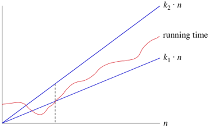
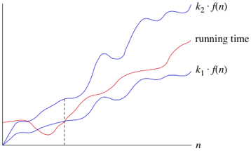

2% penalty for each hour late


# C++
- java main method == int main(void){}
- smallest valid C++ file:
```c++
int main(void){
    return 0;
}
```

- when you have the makefile in the directory with the program, run `make` to make the program and then run the exe (no file extension)
- the test script will compile and test the cpp file automatically
- `System.out.print("hello world")` ↔ `std::cout << "hello world"`
  - adding `<< std::endl` brings the cursor it to the next line like `println`
- `import` ↔ `#include`
  - full file:
    ```c++
    #include <iostream>

    int main(void){
        std::cout << "hello world" << std::endl;
        return 0;
    }
    ```
- if we include `using namespace std;` we can remove `std::` and just use its methods
    ```c++
    #include <iostream>
    using namespace std;

    int main(void){
        cout << "hello world" << endl;
        return 0;
    }
    ```
- `cin >> name` gets input from the keyboard
  - to save it to a variable it must already be instantiated
    ```c++
    #include <iostream>
    using namespace std;

    int main(void){
        string name;
        cout << "hello world" << endl;
        cin >> name;
        cout << "my name is: " << name << endl;
        return 0;
    }
    ```

## Accepting input

- we want to see
```c++
$ ./maxtwo 23 57
57
```
so we use the header:
```c++
int main (int argc, char* argv[])
```
- `argv` is a list of strings; it contains the function call and all of the arguments you give it
  - i.e. `{"./maxtwo", "23", "57"}`
  - since `argv[0]` is the name of the program as the user called it, then we can just call `argv[0]` to remind them of it.
- first we need to check that the user gave the right amount of arguments
  - `argc` gives us the number of arguments
  - i.e. for the call we want, we check that `argc = 3`
```c++
#include <iostream>
using namespace std;
int main (int argc, char* argv[]){

  if (argc !=3){
    cerr << "Usage: " << argv[0] << "<int> <int>" << endl;
    return 1;
  }

  return 0;
}
```
- now we need to turn the strings into integers
- istringstream lets us read fro the input as if we are actively reading it from the keyboard
  - we need to include the sstream header to use it
```c++
#include <iostream>
#include <sstream>
using namespace std;
int main (int argc, char* argv[]){
  istringstream iss;
  int n;

  if (argc !=3){
    cerr << "Usage: " << argv[0] << " <int> <int>" << endl;
    return 1;
  }

  iss.str(argv[1]); /*iss now contains the first argument*/
  iss >> n; /*we read from iss to n. c++ already knows that we want it to be an integer.*/
  cout << n; /*we'll check if this worked or not.*/

  return 0;
}
```
- if we put in an argument that's not an int, our program will break:
```c++
$ ./maxtwo fghjkl 57
0
```
- because the conversion will return true/false if it succeeds/fails, we can add a control block as such:
```c++
#include <iostream>
#include <sstream>
using namespace std;
int main (int argc, char* argv[]){
  istringstream iss;
  int n, m;

  if (argc !=3){
    cerr << "Usage: " << argv[0] << " <int> <int>" << endl;
    return 1;
  }

  iss.str(argv[1]); /*iss now contains the first argument*/
  if (!iss >> n){ /*this line *always* does the conversion whether it fails or succeeds.*/
    cerr << "Error: first command line argument must be int" << endl;
    return 1; /*we have to quit the user out so we don't run the program with wrong inputs anyway.*/
  }

  iss.clear(); /*the istringstream needs to be cleared to remove residual data from the first argument. you could use a second one instead of reusing just one if you wanted.*/
  iss.str(argv[2]); /*iss now contains the second argument*/
  if (!iss >> m){ 
    cerr << "Error: second command line argument must be int" << endl;
    return 1;
  }

  cout << "max(" << n << ", " << m << ") is " << max(n,m) << endl;

  return 0;
}
/*and we've added the actual algorithm to finish.*/
int max(int n, int m){
  if (n > m) return n
  else return m
}
```

and now we will see the thing we want to see:
```
ubuntu@ubuntu:~/Documents/CS385/maxtwo$ ./maxtwo 23 57
max(57, 57) is 32762
```

## Pointer
a pointer stores a memory address of something 
```c++
int x = 5;
int *z = &x;
```
- now z is pointing to x which contains 5.
  - when declaring z the `*` is the pointer type.
- z and x have different addresses
- calling `&z` accesses the address of z, which the computer assigns
- calling `z` accesses the address of **x**, which we stored in it
- calling `*z` accesses the *value* of **x**
  - the star here is the *dereference* operator.
- if we try
  ```c++
  z+=3000;
  ```
  - now z points to some other memory address, 3000 addresses after x, likely random garbage. 
  - the compiler will let you do this. do not do this.
- if a pointer is pointing to a bad place, you will get a `Segmentation fault` or it might just keep running with garbage data
- if you do get a segmentation fault, running `gdb ./[program]` then `run` tells you what line of code causes the error
  - though it will tell you when the garbage is accessed, not when it becomes garbage
  - will not work if you aren't getting a segmentation fault
  - you will need to quit gdb afterward
- when a function call happens, the variable with which it was called (say x) and the variable that is passed to it (say k) will be at different addresses.
  - i.e. any changes that happen to k in the function will not happen to x
  - this is *pass by value*
  - k is destroyed at the end of the function
  - this works the same as python, java, etc
- what if we want to modify `x` in main from the function?
  - we *pass by pointer* instead
  - the function definition takes pointer `*k` so we can pass `f(x&)`
  - now `f`'s code can effect `x` while calling it `*k`
- we also have *pass by reference* in C++
  - define the function with `&k` so you don't need to call the function with the address every time
  - only uses one memory address; k is a reference to the *same* address as x
  - only for the programmer; the compiler rewrites it as pass by pointer for the computer

### Pointers with Dynamically Allocated Memory
- you can declare `int y[10]` with 10 spaces
  - you can call them by `y[i]`
- but if you don't know how many spaces you need, it needs to be declared dynamically
  ```c+++
  cout << "x is" << x << endl;
  int *values;
  values = new int[x];
  ```
  - `values` is only pointing to the first element of the array
    - the rest are stored sequentially after it
  - we can still call elements like in java as `value[i]` 
  - or we can call them like C as `*(values+i)`
- when passing the array to a function, you can pass it like an array or like a pointer
  - just define it in the way you want it
  - `int array[]` → use `array[i]`
  - `int *array` → use `*(values+i)`
- you will need to know the length when iterating
  - there is no `.length` and going past the end will rarely cause a segmentation fault
- when you are done with the array memory you must delete it
  - java and python just do it for you. c++ does not
  - for each `new` there must be a `delete` somewhere
  - i.e. `values = new int[x];` → `delete [] values;`
    - usually done right before `return 0;` at the end
  - after the `delete`, the pointer will be dangling (pointing to nothing/garbage)
  - you can reassign `values` to point to something else if you want

## Classes
- declared like java
- everything under the `public:` header is a public member/method
  - everything under `private:` is private
  - does not have brackets
- constructor with initializer list lest you set everything without a bunch of code
  - put a semicolon after constructor header then list `instance_variable{input}`
  - then `{ }` to because the code block is required even if it is empty
- methods that do not modify member (instance) variables should be declared `const` after the header
  - `void print() const { ... }`
  - NOT like static methods
  - the only requirement is that they do not mutate a member
- class definitions end with semicolons
  - `class Student { ... };`
- local declaration to the stack: `MyPoint point1(x,y,z);`
  - this variable disappears at the end of the method
- declaration to the heap: `MyPoint *point4 = new MyPoint(x,y,z);`
  - similar to java except `point4` is a *pointer* to an anonymous `new MyPoint`
  - the `new` object will stick around until it is actively deleted with `delete point4;`
    - no square brackets because it's just an object, not an array
    - can give it the pointer because it will delete what's at that address, but NOT the content of `point4`
    - `point4` will now point to something that does not exist
    - you should be cleaning up garbage as you go (as you stop using it), not waiting until the very end
- you can use a class an an interface
  - define the class's members and methods with no code blocks/values, then put all of the code for it in a different file

## Vectors
- like an ArrayList
- requires `#include <vector>`
- declare like `vector<MyPoints> points;`
- then use `points.push_back(point1);` to put objects in it
- can access elements like `points[1]`
- we also have `points.size()`, but it returns a `size_t` type
  - `size_t` is effectively the type that can hold the largest possible integer
  - it prints like a regular integer

### regular for loop
```c++
for (size_t i = 0; i < points.size(); i++) {
  points[i].print_coords();
}
```

### for-each loop
```c++
vector<MyPoints> points;
for (const auto &point : points){
  ...
}
```
- `point` is the loop variable
  - it is a reference;
  - we do this instead of copying the element from the array into the loop every time
- `const` tells the compiler to throw an error if we try to change the elements
- `auto` automatically gets the type of the elements in the vector

### iterator loop
```c++
for (auto it = points.cbegin(); it != points.cend(); it++){
  it->print_coords(); // equivalent to (*it).print_coords();
}
```
- `it` is our iterator
- we use `auto` here because the type of the iterator is ugly
- `it++` magically makes the iterator move to the next element
- `->` calls the method with the object the iterator points at

# Algorithms
- an algorithm is a sequence of unambiguous instructions for solving a problem
- its inputs must be specified carefully
- the same algorithm can be implemented different ways
- multiple algorithms might solve the same problem

- sieve - taking a list an removing items that do not fit some criteria
- sum of integers `[1,n]` = n(n+1)/2

# Asymptotic Notation / Rates of Growth
- every function is its own upper bound and lower bound
- you can remove any lower-degree term from the final notation
  - i.e. O(5n² + n) → (n²)
  - this is now asymptotic notation
    - the asymptote is the same even if it's off from the actual function
- when calculating time
  - we can call the time needed for one command c₁
  - and overhead time for initializing loop variables and returning output c₂ both
  - for a loop that runs n times, this makes the whole function n * c₁ + c₂
  - we remove all this when finding asymptotic notation though
    - we care about how it grows, not how long it actually takes
- all logs get written as log n because logs with constant bases differ by a constant factor which we can ignore

## Big O
- O(1) is the best possible rate, as ther is nothing lower
- O is the *asymptotic upper bound* of the function
  - i.e. when n is infinitely large
- any line "under" O(n) is technically part of it
  - e.g. 10n + 5 is in O(n²)

## Big Omega
- Ω() is the *asymptotic lower bound*
- anything above Ω() is part of it
  - e.g. n³ is in Ω(n²)

## Big Theta
- Θ(n) includes both O(n) and Ω(n)
- gives us an *asymptotically tight bound* on running time
- e.g. for Θ(n), there are some k₁, k₂ where k₂n > n > k₁n for large values of n
  - 
  - we're not too worried about small values of n
- the same thing applies for any other random function of n
  - 


## Theorem
 for Ω use min()

### Limit Rule for Growth Rate Comparison

- we will rarely find that the limit DNE
  - still, the fact that it can happen makes this way less general than other ways
- recall L'Hopital's rule
  - 
- also consider sterling's formula
  
  - larger n → better approximation of n!

## Problem Sizes
let's say we have 1 hour of computation time = 3.6*10⁹ microseconds. 
if 
  - we have an algorithm with f(n) = log₂(n)
    - log₂(n) = 3.6\*10⁹ ⇛ n = 2^(3.6\*10⁹) which is a lot of possible calculations
    - note that lg(n) == log₂(n)
  - we have f(n) = n
    - n = 3.6\*10⁹
- some rules about logs and more in [this handout](/notes/Guidelines%20for%20Asymptotic%20Analysis.pdf)

# Check that all characters in string are unique
- set up an unsigned int = 0 and use it as a vector
```
         hgfedcba
vector = 00000000
```
- now we can have a setter shift a 1 into the correct place
  - say we read a g:
  ```c++
  setter = 1 << ('g' - 'a');
  ```
  ```
           hgfedcba
  setter = 01000000
  ```
- do a bitwise `&` between them
  - if it = 0, we have never seen the character before
  - if it is > 0, the character is a duplicate
- now we must remember that we have seen this character (here 'g')
- now we bitwise or `|` the setter and vector to remember all seen characters
  - and put the result into vector
  - e.g. vector = 01000000 ⇛ we've only seen 'g'
  - vector = 11000000 ⇛ we've seen 'gh' in any order

# Recurrence Relations
I have no idea how to explain this. read [his notes](Recurrence%20Relations%201%20Selection%20Sort.txt).

# Stair Climber Problem
- for this section * means prepended with, + means concatenation, and i have to put bracket-heavy lines in `verbatim` formatting to not break vs code
- there are no ways to climb up 0 stairs. lol. lmao. `get_ways(0) = [[]]`
  - ways of climbing stairs = going up combinations of stairs 1 ≤ no. of stairs ≤ 3
- to find amount of ways to climb one stair = get_ways(1), it's
  - 1 prepended to each solution in get_ways(1-1) = get_ways(0) = `1 * [[]]`
  - = `[[1]]`
- get_ways(2)
  - = 1 prepended to each solution of get_ways(2 - 1) = get_ways(1) + 2 prepended to each solution of get_ways(2 - 2) = get_ways(0)
  - = `1 * [[1]] + 2 * [[]]` = `[[1,1] [2]]`
    - ⇛ go up 1 stair then one more stair or go up 2 stairs
- `get_ways(3) = [[1,1,1], [1,2], [2,1], [3]]`
- generally,
  - get_ways(n) = 
  - 1 prepended to each solution of get_ways(n - 1) +
  - 2 prepended to each solution of get_ways(n - 2) + 
  - 3 prepended to each solution of get_ways(n - 3)
- we are prepending to keep everything in first-element-ascending order
- for this algorithm's complexity, we'll look at amount of solutions output instead of running time
  - |get_ways(3)| = 4 = T(3)
  - T(n) = T(n-1) + T(n-2) + T(n-3)
    - with base cases T(0) = 1, T(1) = 1, and T(2) = 2
    - backwards substitution will be miserable
      - works best with only one recursive call
  - instead of calculating exactly (will take forever) we'll approximate with best and worst cases
    - we know it's similar to fibonacci numbers, but it grows faster with one extra recursive call
    - T(n) for fibonacci = F(n) = ϕⁿ/√5 where ϕ = (1 + √5)/2 ≈ 1.62 (golden ratio)
      - which grown exponentially
      - which means our T(n) is at least exponential
  - T(n-1), T(n-2), and T(n-3), have upper bounds of T(n-1)
    - ⇛ T(n) ≤ 3T(n-1) ≤ 9T(n-2) ≤ ... ≤ 3ⁿT(0) = 3ⁿ
      - recall T(0) = 1
  - which leaves up with T(n) = 3ⁿ
    - you an also diagram out the recursive call tree and get the same answer
  - which also means F(n) = ϕⁿ/√5 ≤ T(n) ≤ 3ⁿ
  - out function is also the tribonacci (sum of previous 3 numbers), whose function is ugly but T(n) ∈ Θ(1.84ⁿ), which confirms our exponential growth theory

# Brute Force Algorithms
- find the space of all possible solutions and keep trying until you find the right one
- `struct` is a class except everything is public by default
- a pair acts as a vector of only size 2
  - must `#include <utility>`
- typically has simple code but bad run times
- in c++ you can modify how operators work with a class
  ```c++
  // The new operator<< automatically is a member of the ostream
  // class (that's where the original << operator is defined)
  // so it needs to be a "friend" of the Triple class to be able
  // to access the private instance variables a, b, and c.

  friend ostream& operator<<(ostream &os, const Triple &t) {
  os << t.a << "^2 + " << t.b << "^2 = " << t.c << "^2";
  return os;
  }
  ```
  - *adds* functionality
  - `ostream` is the type of `cout`
    - we use a reference to cout instead of copying it because it will break print continuity
    - we need to return os so you can continue chaining it in use
      - e.g. `cout << triple << endl`
  - `Triple t` is our new type whose functionality we're defining
  - the `friend` keyword lets the `ostream` class look at parts of our `triple` class that it needs to print out our `Triple`
    - in the end it becomes part of the `ostream` class since this is extending its functionality

# Elementary Sorting
- don't use them (bad)
- best case is the perfect input (algorithm doesn't need to do anything)
- average case is when input is truly random
- worst case is when the algorithm needs to do the most
- best, worse, and average cases all have their own big O/Ω bounds
- we measure overall run time from Ω of the best case to O of the worse case

## Bubble Sort
- if you use bubble sort they kill you
  - continuously "bubbles up" largest/second-largest/etc values to tne end
- bubble sort is always Θ(n²) (best, worse, and average cases)
  - even when we optimize it as much as possible, average, worst, and overall cases are Θ(n²)

## Selection Sort
- selection sort puts the smallest at the beginning or the biggest at the end, one at a time
- scans the unsorted part to find the minimum element

## Insertion Sort
- takes the next-smallest value and puts it in the smallest correct position from the beginning
- scans the sorted part to find the correct position to place the element
- the closer the array is to sorted, the closer insertion sort gets to Θ(1)

# Graphs
- degree = amount of edges touching a vertex
- a graph does not need to be one piece
- in code, a graph will be represented as a adjacency list or matrix
  - matrices are better for small or dense (amount of edges near max edges = V²) graphs, where lists take up more space
  - lists are better for sparse graphs where matrices take up a bunch of empty spaces

## Breadth-First Search (BFS)
- start at source and increase distance from the source to travel the graph
- we need a counter which we increase for each new vertex visited
- we need an array of integers to track which vertices we've been to (initialized to all zeros)
  - when we reach a new vertex we'll set its place in the array to the counter so we know in what order we visited it
- a queue of vertices whose neighbors we have yet to visit
- algorithm:
  
- using an adjacency list this takes Θ(V+E)
  - linear search through each vertex and through its edges = Θ(V+E)
- with an adjacency matrix it takes Θ(V²)
  - linear search through each vertex then through all of its *possible* edges ==> Θ(V²)
- paths made by breadth-first search are commonly drawn as rooted trees
- nonrecursive pseudocode:
  

## Depth First Search (DFS)

- depth-first search is used for solving mazes
  - it uses a stack instead of a queue
  - or we can use the function call stack as that stack instead of making one ourselves
- move away from the source as quickly as possible, then return 
- since it's so similar to BFS, just with a different data structure, its running times are similar
  - Using an adjacency matrix: Θ(V²).
  - Using an adjacency list: Θ(V + E).
- iterative python code:
```py
# prints all not yet visited vertices reachable from s 
def DFS(self,s): # prints all vertices in DFS manner from a given source.

    # Initially mark all vertices as not visited 
    visited = [False for i in range(self.V)] 

    # Create a stack for DFS 
    stack = []

    # Push the current source node. 
    stack.append(s) 

    while (len(stack)): 
        # Pop a vertex from stack and print it 
        s = stack[-1] 
        stack.pop()

        # Stack may contain same vertex twice. So 
        # we need to print the popped item only 
        # if it is not visited. 
        if (not visited[s]): 
            print(s,end=' ')
            visited[s] = True

        # Get all adjacent vertices of the popped vertex s 
        # If a adjacent has not been visited, then push it 
        # to the stack. 
        for node in self.adj[s]: 
            if (not visited[node]): 
                stack.append(node) 
```


## Topological Sort
- take a **directed** graph and sort them into one row where all arrows point right
- result is typically not unique
- if the graph has a cycle, topological sort will fail
- Vertices with no incoming edges have no dependencies and therefore can
be traversed first.
### Kahn's Algorithm for Topological Sort
- first we need:
  - An array of integers with one element for each vertex, which we use to
  store the current number of incoming edges each vertex has (the indegree of
  the vertex). 
    - This array can be initialized by setting every value in the array to zero and then traversing the adjacency list or adjacency matrix representing the graph and increasing by 1 the value in the array for every vertex which is the destination of an edge.
  - A set S of all the vertices in the array which currently have an
  indegree of zero. 
    - This is the set of vertices that can be traversed first.
    - This set can be implemented either as a queue or as a stack, it does not matter (but it might produce different results), so here we use a queue.
    - This set can be initialized by traversing the array we just described above and putting into S all the vertices in the array that have an indegree of zero (in increasing order).
  - An empty list L that will contain the result of the topological sort.
- using DFS to do topological sort will always contain all vertices
- it will also work even when there is a cycle
  - we keep track of vertices we've already looked at, so we don't get caught in the cycle
- pseudocode:
  
  
# Water Jug Puzzle
- three jugs of water A, B, C who initially carry A, B, and C gallons of water respectively
- A, B are empty and C is full initially
- we pour water between A, B, C with conservation
  - current amount of water in A, B, C = a, b, c
  - when we do this we have to keep pouring until the destination jug is full or the source jug is empty
- we get the size of each jug from the command line
  - e.g. waterjug 3 5 8 . . . ⇛ we start with capacities (3, 5, 8) and initial state (0, 0, 8) = (A, B, C)
- we also get the goal state from the command line
  - e.g. waterjug . . . 3 5 0 means we want to end up with the jugs containing (3, 5, 0) = (a, b, c)
- our assignment is to find the shortest path from initial to goal condition
  - we use BFS because it gives you the shortest path
- we have been prescribed 6 water transfers, in this order:
  1. C → A
  2. B → A
  3. C → B
  4. A → B
  5. B → C
  6. A → C
  - which means each vertex has ≤6 neighbors
- we don't need to physically create a graph, we just imply one
- need a way to remember which vertex has been visited
- we need to remember the parent of each vertex
- do both: store all previous vertices in a 2d array at `array[a][b]`
  - c = C - a - b
  - array has A+1 rows and B+1 columns

# test review
- largest size n of a problem that can be solved in 1 minute with running time n²
  - n^2 ≤ 60000 ms = 1 min
  - n ≤ √60000 = 244.94, 
  - always round down to **244 = n**
- is 3n-4 ∈ Ω(n²)? give c, n₀ or prove false by contradiction
  - no
  - assume that cn² ≤ 3n-4 ≤ 3n for all n ≥ n₀
  - cn² ≤ 3n
  - cn ≤ 3
  - n ≤ 3/c for all n ≥ n₀; impossible
- solve x(n) = 2x(n-1); x(1) = 4
  1. x(n-1) = 2x(n-2)
     1. x(n) = 2(2x(n-2))
  2. x(n-2) = 2x(n-3)
     1. x(n) = 2(2(2x(n-3)))
  3. x(n) = 2ⁱx(n-i)
  4. base case x(1) ⇛ n-i = 1 ⇛ n = i + 1
  5. x(n) = 2ⁿ⁻¹x(n-(n-1)) = 2ⁿ⁻¹x(1) = 2ⁿ⁻¹\*4 = 2ⁿ⁻¹\*2² = 2ⁿ⁻¹⁺² = 2ⁿ⁺¹
- create and clean up a student object on the stack then the heap
  ```c++
  Student a;

  Student *b = new Student();
  delete b;
  ```
  - can't remove local (stack) variables manually; they disappear when the function ends
  - need `b` to be a pointer or else we don't know its location and `delete` won't work
- what is (15<<2)^22?
  - 15 = 00001111
  - 15 << 2 = 00111100
  - 22 = 00010110
  - (15<<2)^22 = 101010 = 42
  - << = left shift
  - ^ = exclusive OR = XOR

# The Master Theorem
- skips the 5 steps of back substitution
- must follow the shape T(n) = aT(n/b) + f(n)
  - i.e. only divide and conquer, not decrease and conquer (which would call T(n-b))
- 
  - if we only know O() for f, then everything is O. same for Ω().
- a na db must be constants, not functions of n
- 