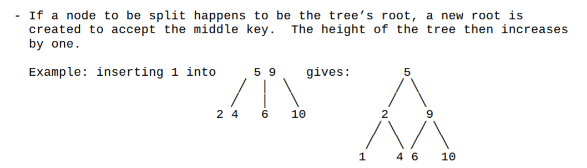

## horner's algorithm
3x^5 - 5x^4 + 5x^3 + x^2 - 20 ⇛ a = [-20, 0, 1, 5, -5, 3]
```
horner(y, x, A)
    y = A[-1]
    for all i ∈ {len(A) downto 0} do y = y*x + a[i]
    return y
```
- n multiplications ⇛ Θ(n) rather than Θ(n²)

## binary exponentiation
```
LeftRightBinaryExponentiation(a, b(n))
//Input: A number a and a list b(n) of binary digits bᵢ, ... , b0 in the binary expansion of a positive integer n; Output: The value of aⁿ
product ← a
for i ← I − 1 downto 0 do
  product ← product ∗ product
  if b i = 1 product ← product ∗ a
return product
```

## 2-3 trees

note that promotion may require more splits among the parent's ancestors.


## prim
finds a minimum spanning tree, O(V²) with adjacency matrix or O(ElgV) with adj. list
```
chosen edges:    | remaining vertices:
a(-, -)          | shortest edges connecting all unvisited nodes to any visited node
next-shortest:   | (if unreachable from source, weight = ∞)
x(parent, weight)| 
```

## kruskal
- O(ElgE)
- sort edges by weight then by node letters
- include edges by increasing weight UNLESS they form a cycle
- find(n) tells you the furthest node from n
  - if find(x) = find(y) then don't link

## dijkstra
finds the shortest path from the source to ANY VERTEX
```
chosen edges:          | remaining vertices:
a(-, -)                | shortest distance from source to *all* unvisited nodes
lighest edge:          | with intermediate = next node on lightest path to root
x(intermediate, weight)| and weight = the weight of that path
```

## floyd-warshall
- finds shortest path between ALL vertices in O(V³)
- add all given weights to D0 (diagonal is all 0s)
  - vertical is "from", horizontal is "to"
- while the graph still contains distances of infinity
  -  for vertices i, j, k in V...
     - if D[i][j] > D[i][k] + D[k][j] then D[i][j] = D[i][k] + D[k][j]
     - i.e. if it's better to go from i to j through k, then do so.

## Edmonds-Karp Algorithm
- worst case O(E⁵), average case O(VE²)
- G_f (residual network) is made of all edges (u, v) where c_f(u, v) > 0
  - where c_f =
    - capacity of (u,v) - current flow of (u,v) if (u,v) exists
      - how much more we can push *into* the real edge
    - current flow (v,u) if the backward edge (v,u) exists
      - i.e. how much we can push *out of* the real edge
    - 0 otherwise.
- on G_f, any path is an augmenting path (since it includes forwards and backwards edges)
- the minimum edge on G_f is the residual capacity
- augment = along augmented path, increase real flow if the real edge is forward, or decrease if it's backward
- our BFS will ignore flow/capacities, just only traveling existing edges
```
edmonds-karp(flow network G, source s, sink t)
initialize all flows to 0
while there exists a path from s to t:
    do BFS to find shortest path from s to t on residual network
    augment real flows by the bottleneck along that path
    update residual network
```

## coin-row
- C = actual list of coins, F = best running sum, S = coin index of last pickup
- F(n) = max(C[n] + F(n - 2), F(n - 1)) for n > 1 and F(0) = 0, F(1) = c₁

## robot coin/collection
- given coin layout table C, we make solution layout F where for all i, j in C, F[i,j] = max(F[i-1, j], F[i, j-1], + C[i, j])
- best coin total is in far bottom-right
- find path thru F in Θ(i+j) time; move right if/until lower is greater, then move down until right is greater

## max sum descent
fill in each space of the pyramid with the sum of its max parent, retrace by following max child

## knapsack
- for item i with weight wᵢ and value vᵢ and knapsack capacity j, 
```
F(i, j) = 0                                         if i = 0 or j = 0
F(i, j) = max(vᵢ + F(i - 1, j - wᵢ), F(i - 1, j))   if wᵢ ≤ j ≤ W (can fit)
          i.e. max(use, lose)
F(i, j) = F(i - 1, j)                               if 0 ≤ j < wᵢ (can't fit)
```
- to backtrack: start bottom-right (i is vertical, j is horizontal)
  - if a cell has the same value as the one above it, we didn't choose it; go one up
  - if a cell is greater than the one above it, then we selected item i; go one up and wᵢ columns left
  - stop if current cell equals 0